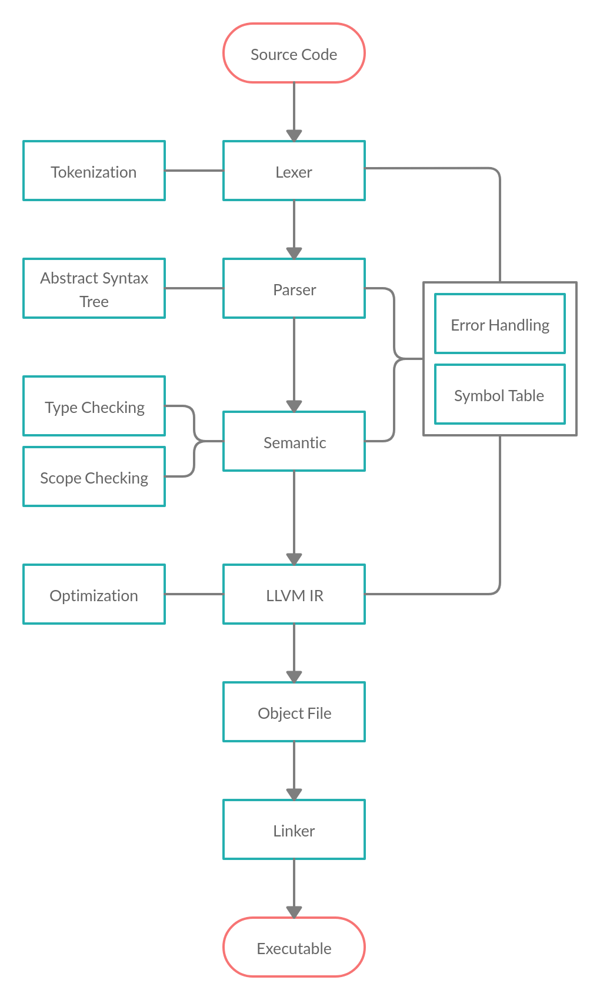

# Arkoi Language

This repository contains the ``compiler``, ``integrations`` of the language and ``examples``
for the Arkoi Language. For more information about ArkoiL, including downloads and documentation
for the latest release, check out [ArkoiL's website](https://lang.arkoisystems.com/).

### Compiler structure:

## Contributing

If you're interested in the development of ArkoiL, please make sure you read the documentation
and youre familiar with the structure of the project. To give a bit information about the 
structure, I did a short summary:

* ``compiler/`` - the compiler source code.
* ``examples`` - examples which you can use to test the language.
* ``natives`` - functions which are directly included to the language (the location will change in the future).

## W.I.P..

## License 

All the subprojects of this repository are licensed under the Apache 2.0 license. You're
explicitly permitted to develop commericial applications using ArkoiL.

You can read more about the license [here](http://www.apache.org/licenses/LICENSE-2.0).

