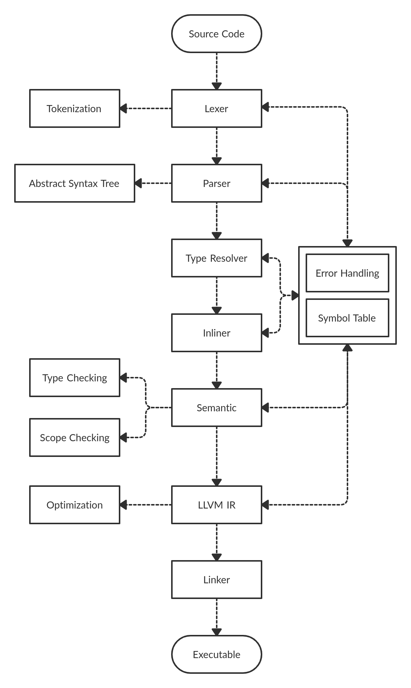

# Arkoi Language
[](https://jitpack.io/#ArkoiSystems/ArkoiL)


This repository contains the ``compiler``, ``integrations`` of the language and ``examples``
for the Arkoi Language. For more information about ArkoiL, including downloads and documentation
for the latest release, check out [ArkoiL's website](https://lang.arkoisystems.com/).

### Compiler structure:


## Getting Started

To build and test this repository you'll need JDK 11 or higher. Eventually this project will
be ported to JDK 14 because it's the newer version with LTS. To check if you have JDK 11 or
higher installed use this command to check your current version:
```
java -version
```
which should output something like this:
```
openjdk version "11.0.6" 2020-01-14
OpenJDK Runtime Environment (build 11.0.6+10-post-Ubuntu-1ubuntu118.04.1)
OpenJDK 64-Bit Server VM (build 11.0.6+10-post-Ubuntu-1ubuntu118.04.1, mixed mode, sharing)
```

Also if you want to build any example (or self written code), you also need to install 
LLVM 10.0.0. ``ArkoiLLVM`` will find the library by itself and so you don't need to do anything
else.

## Contributing

If you're interested in the development of ArkoiL, please make sure you read the documentation
and youre familiar with the structure of the project. To give a bit information about the 
structure, I did a short summary:

* ``compiler/`` - the compiler source code.
* ``examples`` - examples which you can use to test the language.
* ``natives`` - functions which are directly included to the language (the location will change in the future).

## Gradle

``gradle`` is used as an build-automation system tool which provides flexible project 
structures. It is used to build the project and also to generate documentations just with
one click (or command).

If you want to learn more about it, you can visit the offical gralde repository [here](https://github.com/gradle/gradle).

## Maven 

``maven`` is a software project managment and comprehension tool. With it you can 
use external libraries just with a few lines and so you dont need to download anything
manually. In combination with ``gradle`` the process gets even easier, because now
you can use the build.gradle file to setup everything.

If you want to learn more about it, you can visit the official maven repository [here](https://github.com/apache/maven).

## License 

All the subprojects of this repository are licensed under the Apache 2.0 license. You're
explicitly permitted to develop commericial applications using ArkoiL.

You can read more about the license [here](http://www.apache.org/licenses/LICENSE-2.0).

